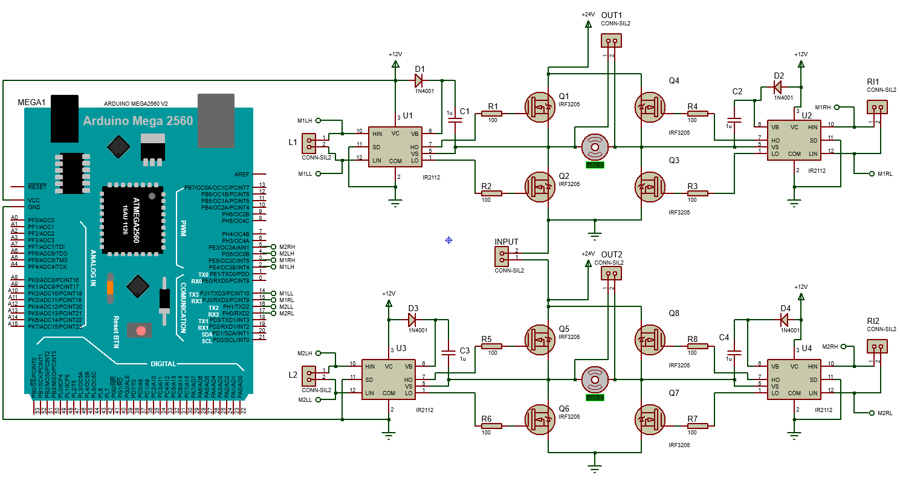
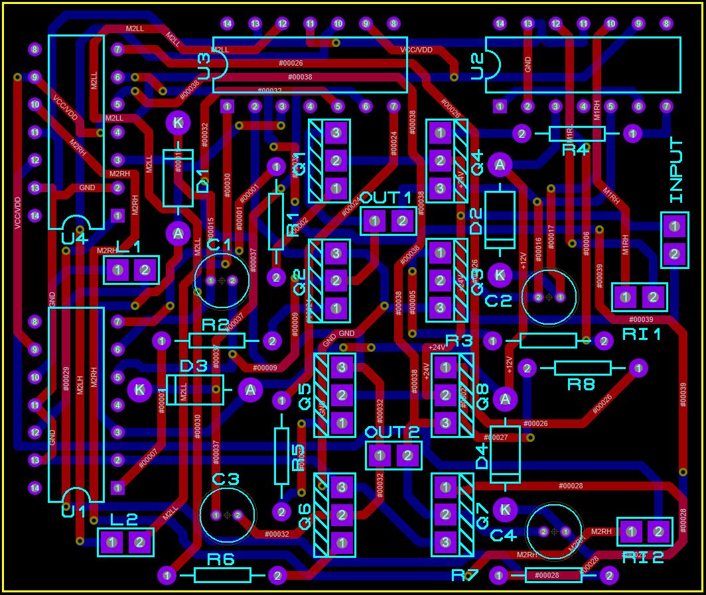
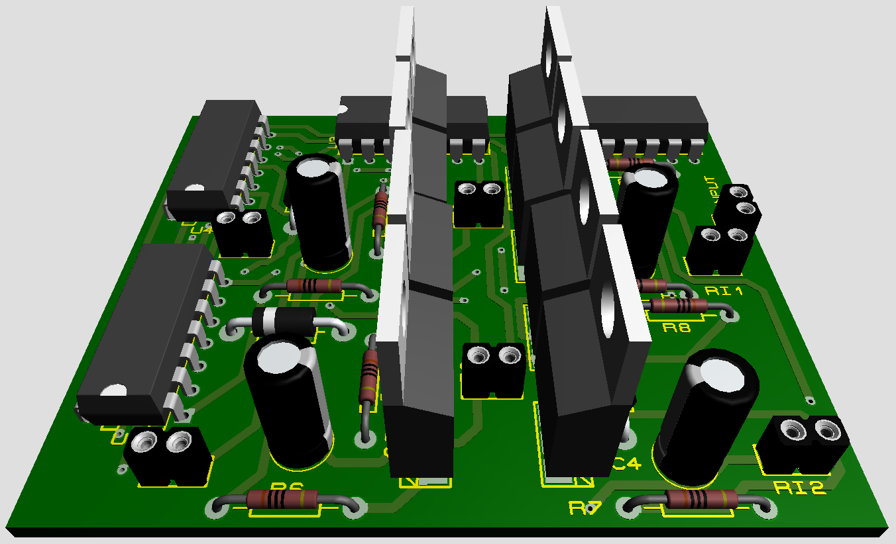

# Motor Driver
Often times, dedicated Motor Drivers (such as L293D) are not readily available and one may be tempted to implement one of their own from discrete components. This repo aims to act as a reference and aid whosoever may desire making a High Voltage / High Power Motor Driver themselves.
## Schematic
#### Use the `.hex` file provided in `code` folder to programatically load Arduino and simulate the circuit using `Proteus Ver. >= 8.13`

## PCB Design

## 3D Visualization

## Arduino (.ino) Files for Testing Functionality
`code` folder contains the `.ino` file that contains prototype functions to run a robot car in all directions using two DC motors.

  <a href="#"><b>End-user can modify the attached code to their needs. <b></a>

